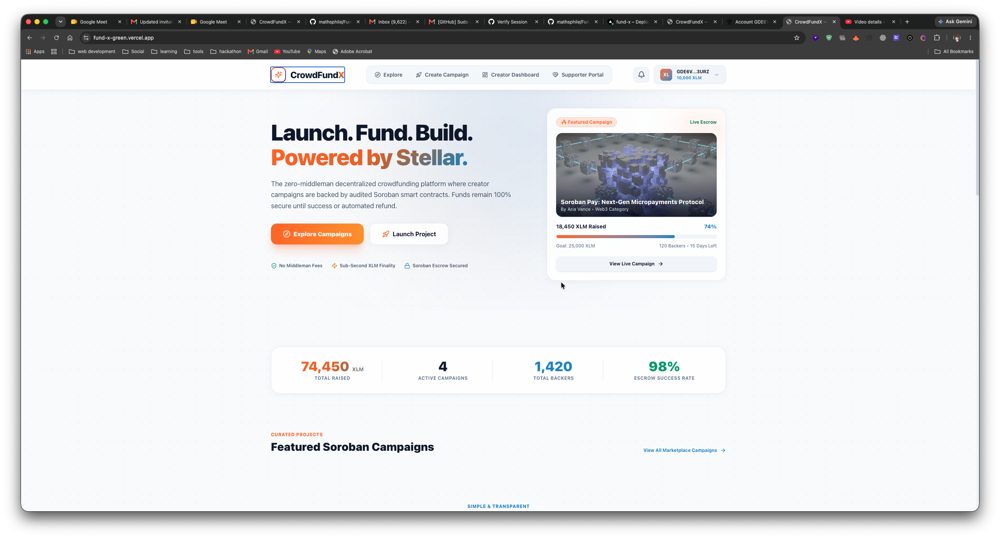
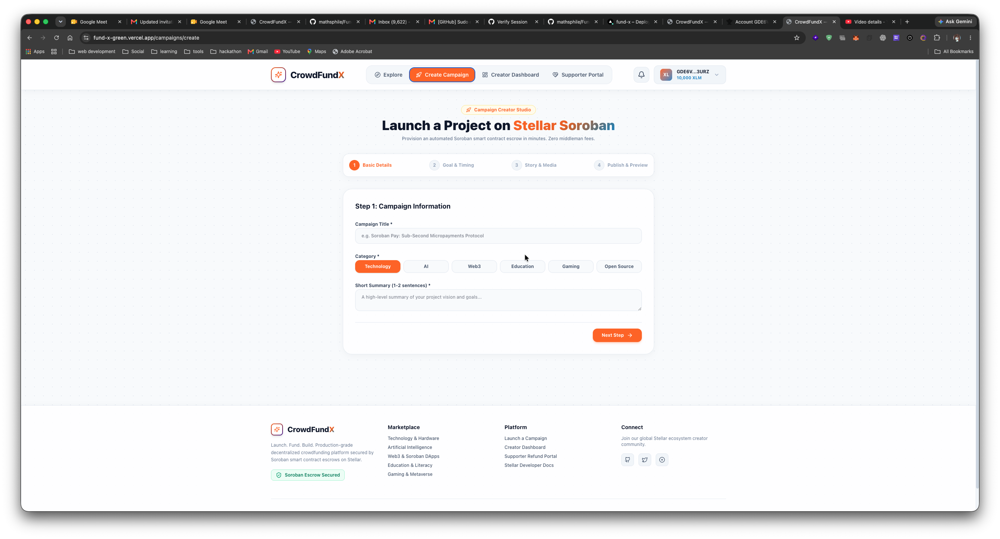
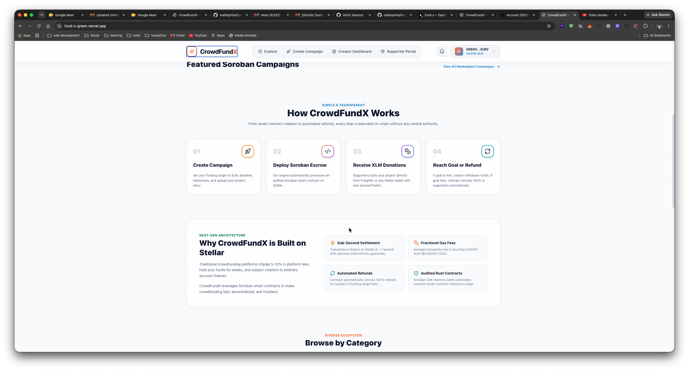
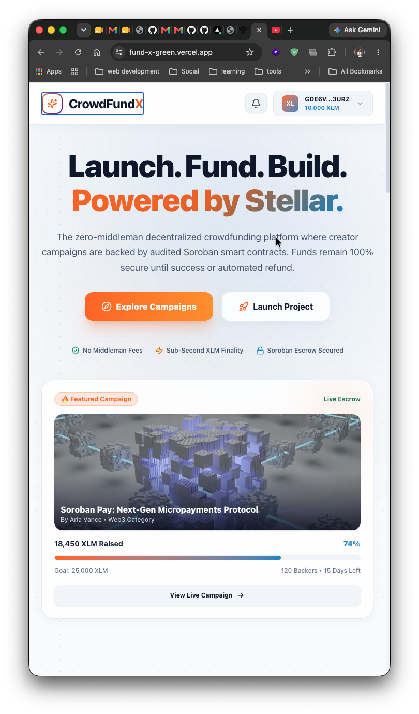
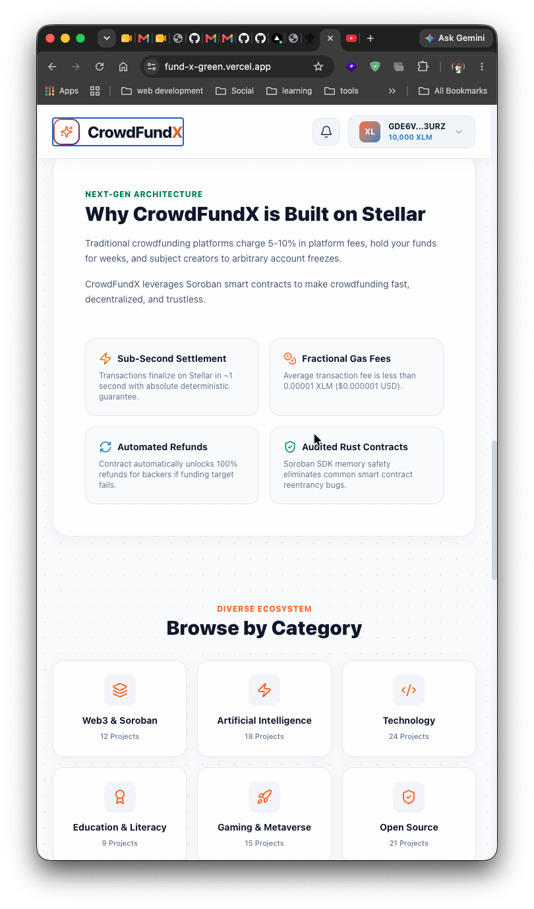
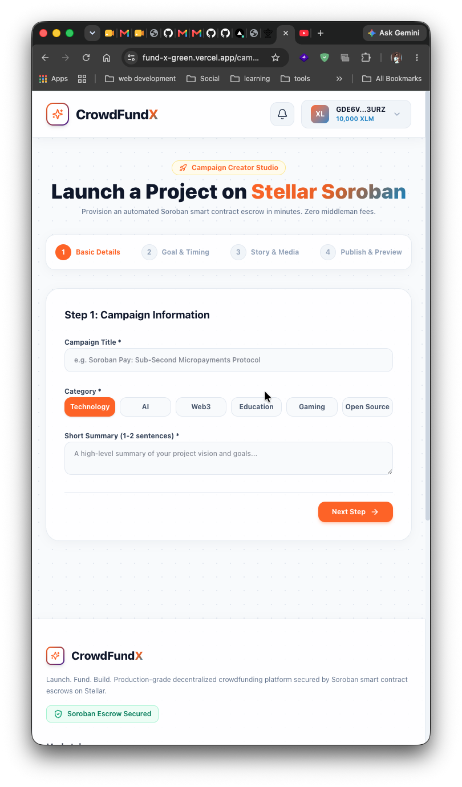

# CrowdFundX — Production-Ready Decentralized Crowdfunding Platform on Stellar

> **"Launch. Fund. Build. Powered by Stellar."**

CrowdFundX is a production-ready, commercial-grade SaaS decentralized crowdfunding platform where creators can raise funds using XLM. Every campaign is backed by an audited **Soroban smart contract escrow** on the Stellar network.

---

## 📸 Platform UI Showcase

### 💻 Desktop Experience

#### 1. Explore Campaigns & Discovery Hub


#### 2. Creator Studio — Campaign Launch Flow


#### 3. Creator Dashboard & Escrow Analytics


---

### 📱 Mobile Responsive Experience

#### 1. Mobile Homepage & Navigation


#### 2. Mobile Wallet Connection & Soroban Escrow


#### 3. Mobile Supporter Portal & Refund Claims


---

## 🎥 Demo Video

[](https://youtu.be/X9E2upV4nJw)

▶️ **Watch the Platform & Soroban Escrow Demo Video on YouTube**: [https://youtu.be/X9E2upV4nJw](https://youtu.be/X9E2upV4nJw)

---

## 📜 Soroban Smart Contract Details (Stellar Testnet)

| Parameter | Value / Address |
| :--- | :--- |
| **Network** | **Stellar Testnet** |
| **Contract ID** | `CDEE2K7UAVF2V2K62P7D5XOTSIWKWBN2Z3I4FU3PBSXWGLMNIMMHB4NE` |
| **WASM Hash** | `103e8cfc5bd3ccc21cdf40d1dddc5486041ba0b82b50d65a38f6dfaf26e2e98e` |
| **Stellar Explorer** | [View Contract on Stellar Expert](https://stellar.expert/explorer/testnet/contract/CDEE2K7UAVF2V2K62P7D5XOTSIWKWBN2Z3I4FU3PBSXWGLMNIMMHB4NE) |
| **Native XLM Contract** | `CDLZFC3SYJYDVR72C5SCNXLI32WVWRK2VXLZ45UKEBRC6EDT3GVSR2HN` |

---

## ✨ Core Platform Features

- 🔐 **100% Soroban Smart Contract Escrow**: XLM funds remain secured inside the smart contract until the campaign succeeds or deadline expires.
- 💸 **Automated 100% Supporter Refunds**: If a campaign fails to reach its funding target before the deadline, supporters can execute a 100% refund claim directly from the contract.
- ⚡ **Sub-Second Finality & Micro Fees**: Built on Stellar's high-throughput ledger with 0.00001 XLM gas costs.
- 🔑 **Wallet Authentication**: Challenge-response nonce authentication signed via Freighter ED25519 keypair.
- 🎨 **Modern SaaS Design**: Built with glassmorphism, glowing accents, Light Mode, loading skeletons, and responsive layouts.
- 📊 **Creator & Supporter Dashboards**: Live analytics, revenue metrics, post update composer, and donation history with direct Stellar Expert links.

---

## 🛠️ Technology Stack

- **Smart Contracts**: Rust, `soroban-sdk v25.0.0`, Stellar CLI
- **Frontend & Backend**: Next.js 15 (App Router), TypeScript, TailwindCSS v4, Framer Motion, Lucide Icons, React Query, Zustand, Sonner
- **Database**: PostgreSQL / Prisma ORM
- **Stellar Integration**: Stellar Wallet Kit, `@stellar/freighter-api`, `@stellar/stellar-sdk`

---

## 🚀 Local Development Setup (Localhost)

Follow these steps to run CrowdFundX on your local machine:

### 1. Prerequisites
- Node.js `v20+` & npm `v10+`
- Rust & Cargo (`rustc 1.95+`)
- Stellar CLI (`25.2.0+`)
- Freighter Browser Extension

### 2. Clone & Install Dependencies
```bash
git clone https://github.com/your-username/crowdfundx.git
cd crowdfundx
npm install
```

### 3. Setup Environment Variables
Create a `.env` file in the root directory:
```env
DATABASE_URL="file:./dev.db"
NEXT_PUBLIC_STELLAR_NETWORK="TESTNET"
NEXT_PUBLIC_STELLAR_RPC_URL="https://soroban-testnet.stellar.org"
NEXT_PUBLIC_STELLAR_NETWORK_PASSPHRASE="Test SDF Network ; September 2015"
NEXT_PUBLIC_NATIVE_XLM_CONTRACT="CDLZFC3SYJYDVR72C5SCNXLI32WVWRK2VXLZ45UKEBRC6EDT3GVSR2HN"
NEXT_PUBLIC_CROWDFUND_CONTRACT_ID="CDEE2K7UAVF2V2K62P7D5XOTSIWKWBN2Z3I4FU3PBSXWGLMNIMMHB4NE"
JWT_SECRET="crowdfundx_super_secret_jwt_key_stellar_2026"
NEXT_PUBLIC_APP_URL="http://localhost:3000"
```

### 4. Database Setup & Seeding
```bash
# Push Prisma schema to SQLite database
npx prisma db push

# Seed initial campaigns across Tech, AI, Web3, Education, Gaming, Open Source
npm run db:seed
```

### 5. Run Local Development Server
```bash
npm run dev
```
Open **[http://localhost:3000](http://localhost:3000)** in your browser!

---

## 🦀 Soroban Smart Contract Development & Testing

### Run Rust Contract Unit Tests
```bash
cd contracts/crowdfund
cargo test
```

### Build Contract to WASM
```bash
cd contracts/crowdfund
stellar contract build
```

### Deploy to Stellar Testnet
```bash
# Generate deployer key & fund via friendbot
stellar keys generate deployer --network testnet
stellar keys fund deployer --network testnet

# Deploy compiled WASM
cd contracts/crowdfund
stellar contract deploy \
  --wasm target/wasm32v1-none/release/crowdfundx_contract.wasm \
  --source deployer \
  --network testnet
```

---

## 📦 Vercel Deployment

CrowdFundX is built as a single Next.js 15 repository deployable directly to Vercel:

1. Push your repository to GitHub.
2. Import the repository into **Vercel**.
3. Add the environment variables (`DATABASE_URL` pointing to Neon PostgreSQL, `NEXT_PUBLIC_CROWDFUND_CONTRACT_ID`, etc.).
4. Click **Deploy**!

---

## 📄 License

Built for **Rise In Stellar Orange Belt (Level 3)**. Open-source under the MIT License.
